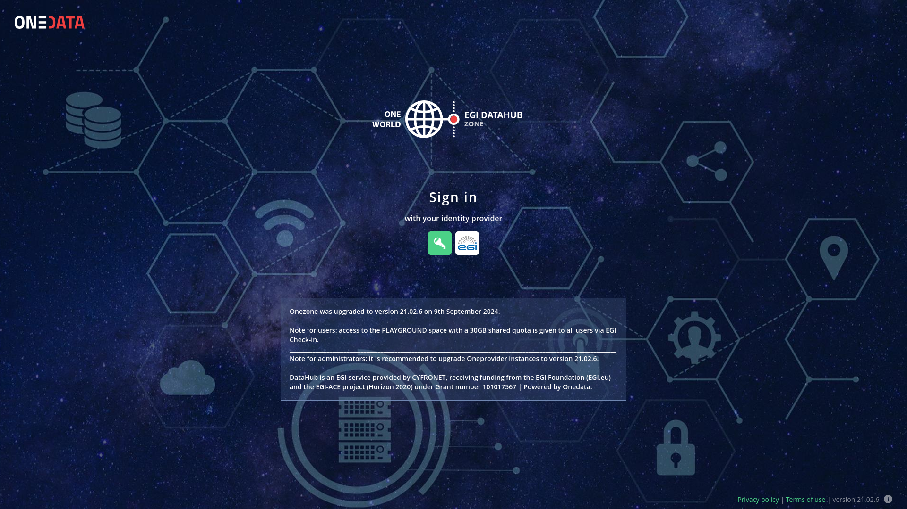
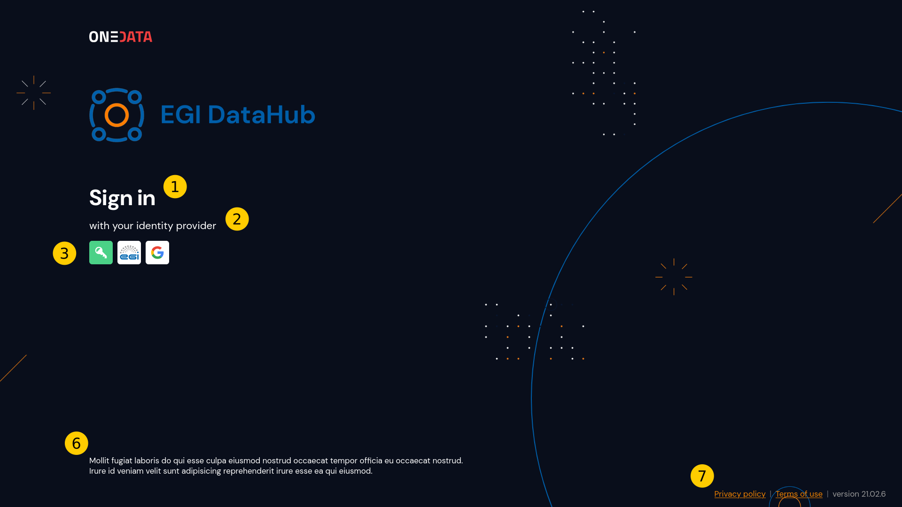
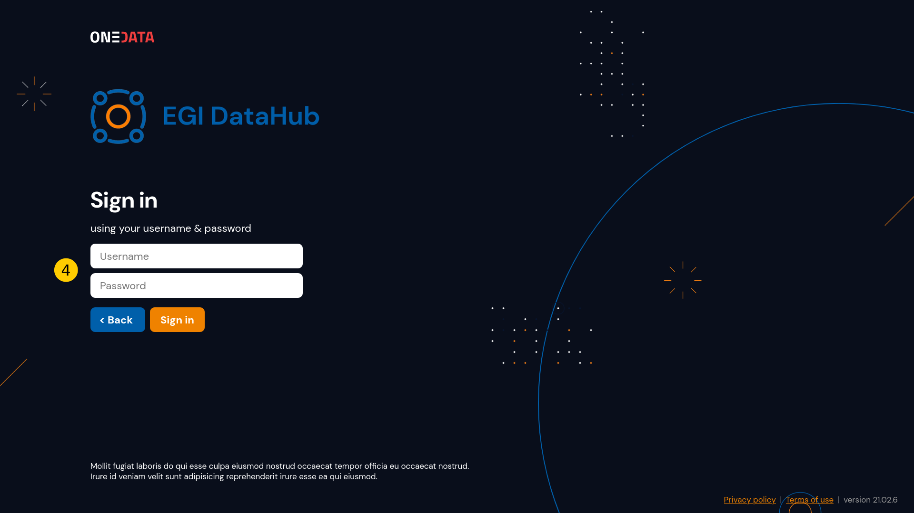
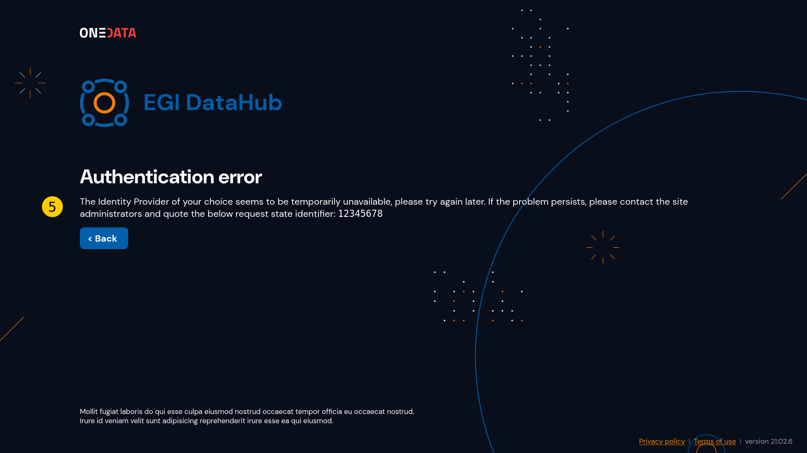
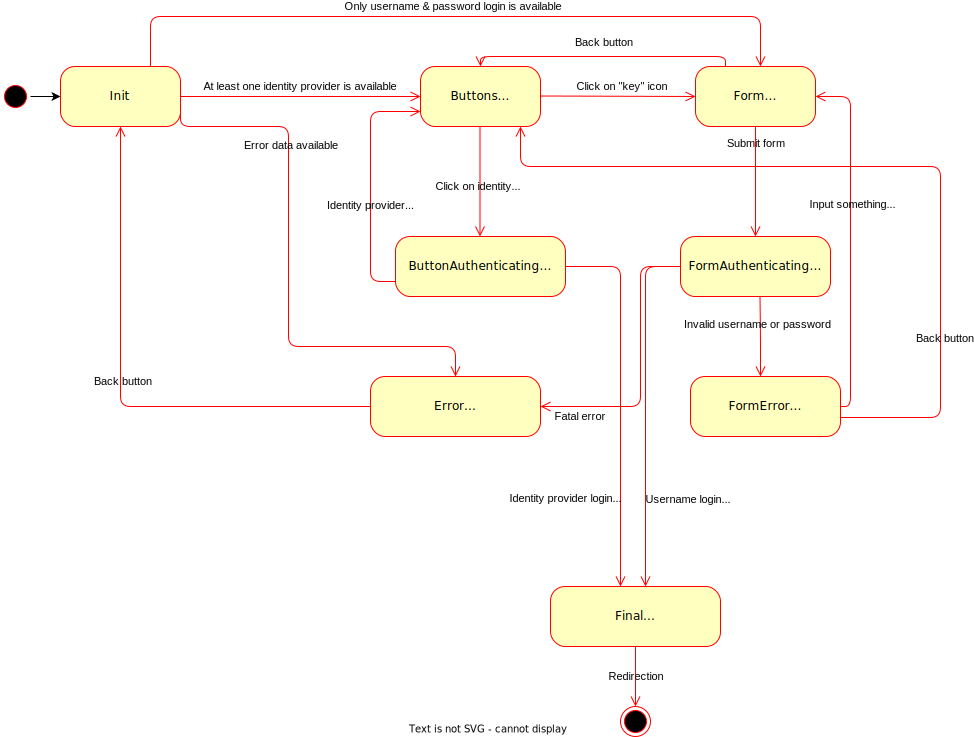

# Custom authentication front page

Onezone GUI of Onedata allows to set a custom authentication view using an HTML template. This repository includes examples of the templates, tutorial and toolkit for launching the HTML template in a mocked environment before applying it in real Onezone GUI.

# Development basics

The front page template is simply an HTML page put in the designated directory with optional static files like images, with some special elements utilized by Onezone GUI to display an authentication view.

## Front page structure

The original, built-in Onezone GUI authentication view looks this way:



We can designate some constant elements like headers, identity providers buttons, username & password form, etc.

These constant elements are styled by the template creator, but are populated with data and controlled by Onedata scripts. Technically, the template should have HTML elements with special IDs. We designate the following elements:

1. **Header** — a first-level header containing "Sign-in" or "Authentication error" text. A `h1` element with `sign-in-header` ID.
2. **Sub-header** — second level header containing text like "with your identity provider" depending on view current context. A `h2` element with `sign-in-subheader` ID.
3. **Login buttons container** — set of available login buttons that starts authentication in the selected identity provider, like Google; also displays a button for opening the username & password authentication form. Not displayed when the only authentication method is by username & password. A `div` element with `login-buttons-container` ID.
4. **Login form container** — text inputs for authenticating username & password, validation message and buttons. Could be displayed automatically instead of login buttons, when the only authentication method is by username & password. A `div` element with `login-form-container` ID.
5. **Error container** — error message when the authentication via identity provider fails. A `div` element with `login-error-container` ID.
6. **Login message container** — a message defined by admin using Onezone cluster GUI settings. A `div` element with `login-message-container` ID.
7. **Footer** — links for _Privacy policy_, _Terms of use_ (if available — can be set using Onezone cluster GUI settings) and Onezone version string. A `div` element with `footer` ID.

Note, that all element should be present in the HTML file. Otherwise, the page would be malfunctioning.

## Examples

You can see examples of these pages in the `examples/` directory. There is a production-grade example `egi-datahub` created for the [https://datahub.egi.eu](EGI Datahub) and a minimal `simple` template. The `simple` template would be a good point to start developing your own template, but the `egi-datahub` is a good reference for a complete, working front page.

The front page structure elements on the example EGI Datahub template look as follows:








## Testing app

Normally, the custom front page static files should be put in to the Onezone container. The template is processed by the Onezone GUI by controlling the events and injecting the necessary data.

To enable the preview for development before launching the template in the real Onezone, this repository contains an application for testing the created template pushing mock data.

You can simply run the `./run.sh` script with the optional relative path to the directory with the developed template. Note, that the template directory must be inside the repo directory. By default, the script setups the environment using `egi-datahub` template.

To launch the `simple` template, invoke the following command from the root directory of the repository:

```shell
./run.sh examples/template
```

The docker container should start with the integration web app. When the docker starts, you should see the following message above the `http-server` status:

```
+-----------------------------------------------------------------+
| Open the mock app: http://localhost:8080/ozw/onezone/index.html |
+-----------------------------------------------------------------+
```

Open the above URL to see the mocked login page. All changes made in the `examples/template` files will be visible on full page refresh (you should use refresh with cache clear, typically using `ctrl + shift + r`).

## Installing the front page

When you are ready to deploy the front page, copy the template directory containing `index.html` to the `/var/www/html/oz_worker/custom/frontpage` location in the Onezone container (the location could not exist, so you should create it). Finally, you should have a `/var/www/html/oz_worker/custom/frontpage/index.html` file.

Refresh the Onezone GUI login page — you should see your own authentication page instead of built-in one. Test the typical scenarios and check the JS console to see if there are no errors.

# Technical details

The custom front page is rendered in the iframe, which has data and API injected by the main Onezone GUI frame. The page is controlled using a script using a state machine, where states are representing e.g. "displaying buttons", "displaying username form" or "displaying error". Template creator does not need to know the technical details how the script work, because states change automatically due to events like identity provider box click.

## Injected data and API

The data and API injected into the iframe includes:

- **Available authenticators data** — to display authentication buttons. Color of button background and icon path if sent by backend, so styling of these buttons is limited.
- **Login message** — which can be set by Onezone admin. The login message can be empty.
- **Footer data** — URLs to privacy policy and terms of use (if available) and version string.
- **Warning data** — information if "session expired" and/or "domain mismatch" message should be displayed on the login screen on initialization.
- **Authentication error data** — message about authentication error.
- **Authentication API methods** — methods that invokes authentication on the Onezone GUI side.
- **Texts (i18n)** — all texts like "Sign in", "using your username & password" etc. are injected from the main Onezone GUI frame. Currently, only the English language is available, but the mechanism is coupled with i18n system in Onezone GUI which may be extended someday.

## Login view states

There are 8 states of the login screen:

1. **Initialization** — user just entered the login screen and the script will decide to which state transition into: showing buttons, showing username form or showing error.
2. **Buttons** — display clickable identity provider buttons.
3. **Form** — display username & password form instead of identity provider buttons.
4. **Button authenticating** — user clicked some button from state (3), and we wait to be redirected to the identity provider's login page (or to be authenticated automatically). This state replaces the clicked authenticator icon to `.login-icon-spinner` element, which can be styled. See `egi-datahub` for example implementation.
5. **Form authenticating** — user submitted the username & password, either hitting enter on the input or clicking on the `Sign in` button. In this state, the submit button has a `.loading` class and an additional `.button-spinner` element.
6. **Error** — there was an error when authenticating, and the error message is displayed instead of login buttons or form. You can simulate the error view by adding `#error` to the URL, e.g. http://localhost:8080/ozw/onezone/index.html#error
7. **Form error** — user entered invalid username and/or password. The `.has-error` class is added to inputs and small information about invalid credentials is displayed.
8. **Final** — authentication succeeded and page is being redirected to the authenticated Onezone GUI.

The below diagram shows possible state transitions:

